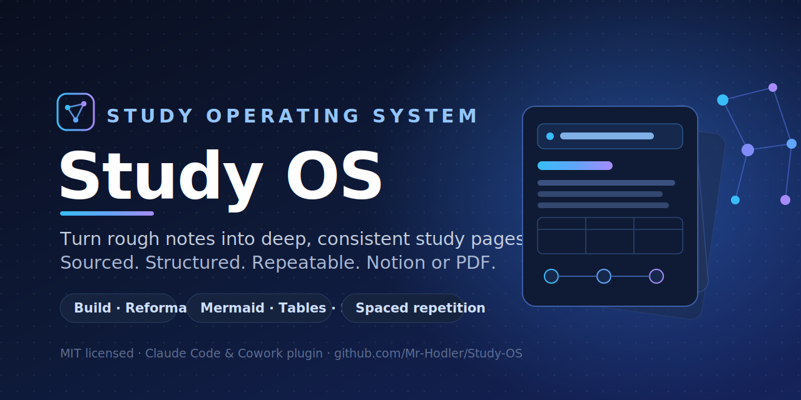

# Study OS



A study toolkit for Notion. It turns sparse inputs (keywords, topics, dumped notes) into **deep, expert-level, consistently structured study pages**, and keeps the whole study **library** clean and organized.

Built to fix a common problem: generic AI writing stays shallow and high-level. Study OS researches, goes chapter by chapter, cites dated sources, and lays content out for fast reading and long-term reuse. Every page comes out with the same architecture and the same rigor, regardless of topic.

## Two skills

This plugin ships two complementary skills:

- **Study OS** — authors one page. Reads a Notion page or your prompt, researches with dated sources, and writes a deep, structured study page (Notion or PDF). Modes: **Build**, **Reformat**, **Explain**, **Refresh**.
- **Study Librarian** — curates the collection. Audits structure and consistency across all pages, fixes metadata, maintains the prerequisite/related knowledge graph, deduplicates, and builds a library map. Modes: **Audit**, **Organize**, **Map**, **Dedupe**. It manages the material and its organization, never your personal learning state.

> Study OS = build a page. Study Librarian = curate the library of pages.

## Design principles

- **Depth with structure.** Concise never means shallow. Bullets to structure claims; short paragraphs only for complex points; tables, columns, and diagrams where they help.
- **Sources are mandatory** for theory material: authoritative, dated, embedded as hyperlinks. No bare URLs.
- **Consistency is the product.** The same activity type always yields the same shape.
- **Agnostic by design.** No hardcoded categories, property names, or database IDs. The skill reads any Notion schema at runtime, so anyone can use it for any subject in any workspace.

## Repository layout

This repo is a self-contained Claude plugin (and a one-plugin marketplace), so it installs directly.

```
Study-OS-Repo/                           # repo root = the plugin AND the marketplace
├── .claude-plugin/
│   ├── plugin.json                      # plugin manifest (name, version, metadata)
│   └── marketplace.json                 # marketplace manifest listing this plugin
├── README.md
├── CHANGELOG.md                         # version history (Keep a Changelog)
├── CONTRIBUTING.md                      # how to propose changes
├── LICENSE                              # MIT
├── .gitignore
├── assets/                             # repo cover (svg + png), not study content
├── study-os.skill                      # packaged Study OS skill (one-click install)
├── study-librarian.skill               # packaged Study Librarian skill (one-click install)
└── skills/
    ├── study-os/                       # SKILL 1: build a study page
    │   ├── SKILL.md
    │   └── references/                 # writing-standards, page-architecture, notion-operations,
    │                                   # research-protocol, classification, reformat-mode,
    │                                   # output-targets, media-assets, qa-review
    └── study-librarian/                # SKILL 2: curate the library
        ├── SKILL.md
        └── references/                 # library-operations, audit-checklist
```

## Setup

Connect the **Notion connector** before first use: the skill reads the source page, detects the database schema, and writes back. For PDF/doc output a document tool is also used. No configuration files are needed; the skill adapts to whatever workspace and schema it finds.

## Install

Pick one of the three options below.

### Option A - one-click `.skill` (Cowork)

Open `study-os.skill` and use **Save skill**. This installs the skill directly without touching a marketplace.

### Option B - Claude Code (or Cowork) via marketplace

```
/plugin marketplace add Mr-Hodler/Study-OS
/plugin install study-os@study-os
```

The first command registers this repo as a marketplace; the second installs the `study-os` plugin from it. After install, the skill is discovered automatically.

### Option C - manual / local

Clone the repo and add it as a local marketplace, or drop the `skills/study-os/` folder into your skills directory so `SKILL.md` is discoverable:

```
/plugin marketplace add /path/to/Study-OS-Repo
/plugin install study-os@study-os
```

### Triggers

The skill activates on phrases like "build the study page", "structure this study page", "research this topic in Notion", "make a study PDF about X", "reformat this page", or "explain this concept".

## Usage and examples

### Study OS — author one page
Use it when you want a single topic turned into a deep, structured page.

```
Open <Notion page URL> and build the full study material.
Research <topic> and write it up as a study page under <database>.
Deepen this page, chapter by chapter, with sources.
Reformat this page for skimmability without changing the words.
Refresh the dated facts on this page.
Explain <concept> simply.
```

For theory pages it proposes a chapter index and source list first, then writes; say "autonomous" to skip the confirmation.

### Study Librarian — curate the whole library
Use it when the job is about the collection, not one page. What it is for, with examples:

- **Navigate / find** — "where in my study DB is anything on prompt injection?" or "do I have a page on vector databases?" It answers with the page links, or tells you it is a gap.
- **What's missing** — "audit my study library and tell me what's inconsistent or missing." It reports orphan pages, broken structure, and topic gaps, prioritized.
- **Organize** — "set categories and reading order across my AI pages and link their prerequisites." It fixes metadata and the prerequisite/related graph. It never touches your `Status` or `Next review`.
- **Map / index** — "build me an index page that maps my whole study library." It generates a categorized index plus a Mermaid graph of how pages depend on each other.
- **Scaffold from a plan** — "here's a 10-module curriculum on real estate finance, set up the structure to fill in." It creates a hub and one stub page per module, with metadata and prerequisite links, ready for **Study OS** to fill.
- **Dedupe** — "find overlapping notes and suggest merges." It flags duplicates and proposes a merge or a clean scope split (on your confirmation).

> Typical combined flow: **Librarian scaffolds** the structure from your plan, then **Study OS fills** each page, then **Librarian audits and maps** the result.

### Triggers
- Study OS: "build / structure this study page", "research this topic in Notion", "make a study PDF about X", "reformat / refresh this page", "explain this concept".
- Study Librarian: "audit my study library", "where is X / what covers Y", "what's missing", "organize the database", "map / index my library", "turn this plan into a structure", "find duplicates".

## Versioning and contributing

Version history lives in [CHANGELOG.md](CHANGELOG.md). To propose changes, see [CONTRIBUTING.md](CONTRIBUTING.md). The project follows [Semantic Versioning](https://semver.org/).

## Author

Built by **Aron Clementi** ([@Mr-Hodler](https://github.com/Mr-Hodler)). The need was simple: something to manage my study and theory pages in Notion. Start from nothing or from unstructured keywords, turn them into clean, deep, consistent material, and keep the whole library maintained over time. Study OS is that tool. Feedback and pull requests are welcome.

## License

MIT. See [LICENSE](LICENSE). Copyright (c) 2026 Aron Clementi.
