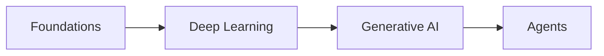

# Library Operations

How to read and curate the study database and its material. Environment-agnostic: always read the live schema first.

## Read the library

1. Fetch the study database and its data source: `notion-fetch` on the database URL, then on the `collection://<data_source_id>` from the `<data-source>` tag. Read the property schema and option values from there.
2. Enumerate the rows (pages). For hub pages, also note their child sub-pages.
3. Build an in-memory picture: title, category, scope, reading order, content description, page URL, prerequisites, related links, and which pages link to which.

Never hardcode property names or IDs. If a property the librarian relies on is missing (e.g. Category, Reading Order, Prerequisites), proceed with what exists and optionally suggest adding it (`notion-update-data-source`), only with consent.

## Metadata hygiene (Organize mode)

For each page, set or correct, using the live schema:
- **Category** from the existing options (never invent new ones unless asked).
- **Scope** (Theory / Practice) per the classification rules shared with Study OS.
- **Reading order** coherent across siblings (no gaps or duplicates within a category/series).
- **Content description**: a sharp 1 to 2 line summary.
- **Page URL** if the schema tracks it.

**Never change** `Status` or `Next review`: those are the user's learning state, out of scope.

## The knowledge graph

A good library is connected. Maintain two layers:
- **Prerequisites** relation (database self-relation): link each page to the pages it should be read after. This encodes the learning-order dependency of the *material* (not the user's progress).
- **Related** lines and inline `<mention-page>` links in page bodies: cross-link overlapping or adjacent topics.

When organizing, ensure every page has at least one connection (category plus a prerequisite or related link). Flag any page with none as an **orphan**.

## Deduplication (Dedupe mode)

- Detect overlap by comparing titles, content descriptions, categories, and chapter headings.
- For genuine duplicates: propose which page to keep and which to merge or archive. Act only on confirmation.
- For partial overlap: propose a clean **scope split** instead, using Non-scope and Related lines so each page owns its slice.
- Never delete a page without explicit confirmation; when merging, preserve any child pages and attachments.

## Library map / index (Map mode)

Build or refresh one overview page that makes the whole collection navigable:
- **By category:** each category as a section listing its pages (as page links), in reading order.
- **A Mermaid graph** of the prerequisite relations, so the dependency structure is visible at a glance:

- **Orphans:** pages with no links in or out.
- **Gaps:** topics a complete library on this subject would be expected to have but does not (use judgement and the category structure).

Keep the map page itself consistent with the Study OS page standards (meta callout, clean headings, no em dashes).

## Scaffolding (Scaffold mode)

Turn a study plan or curriculum into an empty, well-organized structure that Study OS can fill.

1. **Get the plan.** It may come from the user (a list of topics/modules), an existing outline, or be implied by a subject ("set up a library for learning real estate finance").
2. **Confirm the structure** before creating pages: the hub title, the list of stub pages (one per item), their categories, and the reading order. For a theory subject this mirrors the Study OS hub-and-parts shape.
3. **Create the skeleton:**
   - One **hub page** with a meta callout, a purpose/non-scope callout, and a `## Deep dives` section that will hold the sub-page cards.
   - One **stub page per item**, each with: a clear title, a meta callout, a one-line purpose, and a `## To be written` note. Keep stubs intentionally empty of deep content.
   - Set **metadata** on each (category from existing options, scope, reading order) and the **Prerequisites** links so the dependency graph is in place from day one.
4. **Hand off:** tell the user to run **Study OS** on each stub (or the whole set) to write the real content. The Librarian never writes the deep content itself; it builds the frame.

This is the inverse of Dedupe: Dedupe collapses an over-grown library, Scaffold grows a planned one. Both keep the collection coherent.

## Safety

- Audit, Find, and Map are read-only with respect to page content.
- Organize edits metadata and links only.
- Dedupe/merge requires confirmation and preserves child pages and attachments.
- Re-fetch after any change to verify it applied as intended.
