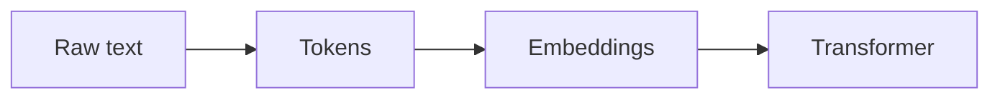

# Media & Assets

How to put real visuals into a study page. These behaviors are verified against Notion through the connector. Use the right tool per media type; do not fall back to a text placeholder when a real visual is possible.

## Decision table

| Need | Use | Notes |
| --- | --- | --- |
| Flowchart, process, sequence, hierarchy, ER, state, timeline, mindmap | **Mermaid code block** | Renders natively in Notion. First choice for schemas and diagrams. |
| Simple data chart (bar, line, pie) | **Mermaid** (`pie`, `xychart-beta`) or a generated image file | Mermaid for quick charts; generated file when precise. |
| A real existing diagram, photo, or figure | **``** only if the host allows hotlinking; otherwise generated-file + slot | Many hosts (incl. Wikimedia) render blank in Notion. Default to Mermaid or a generated file. |
| A chart from the user's own data, or any raster the page really needs | **Generate a PNG/SVG file** in the sandbox, present it, mark an image slot | The skill cannot upload to Notion or host a public URL, so the user drags the file in. Reliable. |
| Video | **A "Watch" list of links** | The connector stores a plain URL as a link; the user can convert it to a player by pasting in the app. |
| Comparison / matrix / timeline of values | **Table** | Not an image. See page-architecture. |

## Mermaid (the workhorse)

Put diagrams in a fenced `mermaid` block. Verified to render. Quote node labels to be safe.

Useful types: `flowchart`, `sequenceDiagram`, `stateDiagram-v2`, `erDiagram`, `mindmap`, `timeline`, `gantt`, `pie`, `xychart-beta`. Keep diagrams small and legible; one idea per diagram. Arrows (`-->`) are safe inside the block.

## Images by URL (use with caution)

```

*Source: [Name, CC BY-SA](https://...)*
```
Reality check, learned in production: **many hosts block hotlinking, so the image block is created but shows blank in Notion.** Wikimedia Commons in particular often does not render when embedded. So:
- **Do not rely on an external image URL unless you have a host known to allow hotlinking** (e.g. raw.githubusercontent.com, official CDN). When in doubt, it will probably show blank.
- **Prefer Mermaid** for anything diagram-like (it always renders), or **generate the image as a file** and use an image slot for the user to upload.
- Only use Markdown ``; the `<image>`/`<embed>` tags render as literal text. Always add attribution.
- If you do embed a URL, treat it as best-effort and pair it with a fallback (a Mermaid version or an image slot) so the page is never left with a blank box.

## Generated assets (charts/infographics the user must upload)

When a precise chart or infographic is needed and no clean public image exists:
1. Generate it in the sandbox (matplotlib/plotly for charts; a clean SVG/HTML for infographics).
2. Save it and present the file to the user.
3. At the exact spot in the page, leave an image slot so they know where it goes:
```
<callout icon="🖼️" color="yellow_bg">
	**Drop image here:** `chart-scaling-laws.png` (just generated, see chat)
	**Shows:** loss vs compute on a log-log scale with the Chinchilla point marked.
</callout>
```

## Videos

Group curated videos in a short section so they are easy to find:
```
## Watch
- [The Illustrated Transformer talk (YouTube)](https://www.youtube.com/watch?v=...)
- [3Blue1Brown, attention explained (YouTube)](https://www.youtube.com/watch?v=...)
```
Pick 1 to 3 genuinely high-quality videos (lectures, official talks, top explainers). Note to the user that pasting the link on its own line in Notion offers a player embed.

## Notion handoff (what the app does better than the API)

Mermaid is the default for diagrams because it is cheap, native, and consistent. Do NOT route core writing or diagram generation through Notion AI: it reintroduces the shallow, inconsistent output Study OS exists to replace, and it cannot be invoked through this connector anyway.

There are a few things the Notion app genuinely does better than the API. For these, the skill cannot do the action itself, so it leaves a precise **handoff callout** telling the user exactly what to do, with a ready-to-paste prompt where useful:

- **Upload a real image** (the API cannot upload files). 
- **Convert a video link into a player embed** (paste the URL on its own line and pick "Embed").
- **Native database charts** for data that lives in a Notion database (Notion's own chart blocks beat a static image).
- **Whiteboard / visual mind map** when the user wants to drag nodes by hand.

Handoff callout pattern:
```
<callout icon="🛠️" color="blue_bg">
	**Do this in Notion:** [the one action, e.g. "upload chart.png here" or "turn this link into an embed"]
	**Paste into Notion AI (optional):** "[a concrete, ready-to-run prompt if the task suits Notion AI, e.g. 'Create a mind map of the six AI parts on this page']"
</callout>
```
Use handoffs sparingly and only for these app-only tasks. Everything else (flows, schemas, mind maps as diagrams) is Mermaid, made here.

## Hard rules

- A diagram that can be Mermaid should be Mermaid, not an image slot or a Notion AI request.
- Every embedded image carries attribution.
- Never invent an image URL. If unsure it resolves and is license-clean, use Mermaid or an image slot instead.
