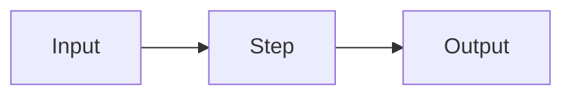

# Page Architecture

The fixed skeleton every Study OS page follows, plus the exact Notion-flavored Markdown block syntax to produce it. Consistency here is the whole point: a reader should recognize the structure instantly across topics.

## The skeleton (in order)

1. **Meta callout** (gray background): `Last Updated` + `Related`.
2. **Purpose callout** (blue background): `Page Purpose`, `Non-scope`, and a one-line **What you get here** (the signpost legend).
3. A warm one-paragraph **intro with a hook** (see the soul rules in `writing-standards.md`).
4. **Sub-pages index, near the top.** If the page is a hub with sub-pages, put the index right here as a `## Deep dives` table or a 2-column block: one row per sub-page, with a one-line focus and the link. The reader sees the map before the content, not buried at the bottom.
5. `# Page Topic`, a horizontal rule `---`, then `<table_of_contents/>`.
6. **Chapters as real `## H2` headings** (H3 for sub-points). Each chapter opens with a one-line hook, then substance shaped to the material using the signposts (💡 key idea, 💬 example, 🔑 insight, ⚠️ watch out, 📚 go deeper). Chapters are NOT toggles.
7. Page-level `## Glossary`, `## Resources`, `## Sources` at the end.

**Toggles are for minor content only:** long tangents, raw data dumps, extended derivations, or appendix material. Never wrap a whole chapter in a toggle.

## Use Notion's structure aggressively (not just text)

A page that is only headings and bullets wastes the medium. Reach for these whenever the material fits:

- **Tables** for any comparison or matrix: options vs dimensions, timelines (date / milestone), families (item / how it works / strength / weakness), pros vs cons. If you find yourself writing parallel bullets that all share the same fields, it is a table.
- **Columns** for two parallel blocks of similar weight: open vs closed, theory vs practice, before vs after, two competing positions. Saves vertical space and reads faster.
- **Schemas / diagrams.** Prefer a real image (see image slots below). When an image is overkill, draw a simple flow as ASCII inside a fenced code block (code is rendered literally, so arrows are safe there):
```
Pretraining  ->  SFT  ->  RLHF / DPO  ->  aligned assistant
```
- **Callouts** to make a key insight, warning, or definition pop out of the flow.

## Visuals: prefer real ones over placeholders

Full rules in `references/media-assets.md`. Order of preference:

1. **Mermaid** for any diagram/schema (renders natively):

2. **Image by URL** when a clean public figure exists (Wikimedia/official), with attribution:
```

*Source: [Wikimedia Commons, CC BY-SA](https://commons.wikimedia.org/...)*
```
3. **Generated asset + image slot** only when a precise chart is needed and no clean URL exists. Generate the file, present it, and mark the spot:
```
<callout icon="🖼️" color="yellow_bg">
	**Drop image here:** `filename.png` (generated, see chat) — **Shows:** [what it depicts].
</callout>
```
Do NOT use `<image>` or `<embed>` tags; the connector renders them as literal text. Videos go in a short `## Watch` list of links.

## Chapter depth (what a good chapter contains)

Shape varies, but a strong chapter usually has: a one-line hook, 💡 a key idea, the substance (bullets/table/columns/diagram), 💬 a concrete or numeric example, ⚠️ a common misconception where one exists, and 📚 go deeper. For meaty topics add a 🧭 **open question / frontier** line. Keep a page-level **level** (beginner / intermediate / advanced) and **reading time** in the meta callout.

## Signpost system (the soul layer)

Use these consistently so every page feels familiar and scannable. Apply as inline bold labels or small callouts:
- 💡 **Key idea** - the core insight in one or two lines.
- 💬 **Example** - a concrete, real example or mini-scenario.
- 🔑 **Insight** - a sharp, memorable rule of thumb.
- ⚠️ **Watch out** - a common mistake, risk, or misconception.
- 📚 **Go deeper** - sources and the deep-dive sub-page.

## Block syntax (Notion-flavored Markdown)

Verified against live Notion content. Use exactly these forms. When unsure, fetch a known well-formatted page and mirror its syntax rather than guessing.

### Callouts
```
<callout icon="💡" color="blue_bg">
	**Page Purpose:** What this page contains and why it exists.
	**Non-scope:** What this page deliberately does not cover.
	**Related Pages:**
	- <mention-page url="https://www.notion.so/PAGE_ID"/> – relationship and difference
</callout>
```
Common colors: `gray_bg` (neutral/meta), `blue_bg` (insight/purpose), `green_bg` (positive). Use `icon` optionally.

### Meta callout
```
<callout color="gray_bg">
	**Last Updated:** <mention-date start="2026-05-30"/>
	**Related Pages:** <mention-page url="..."/>
</callout>
```

### Headings + rule
```
# Main Topic
---
## Subsection
### Detail
```

### Chapter as a heading (default)
A chapter is an `## H2` heading with a hook line, then substance. Example shape (vary it per topic):
```
## Tokenization, the model's alphabet

Models never see words. They see tokens, and that single fact explains cost, context limits, and why they fumble rare strings.

💡 **Key idea:** text is split into subword fragments mapped to integer IDs, then to learned vectors.

- **Why subwords:** whole-word vocabularies explode and break on new words; BPE splits "tokenization" into `token` + `ization`.
- **Why it matters:** pricing, latency, and the context window are all counted in tokens, not words.

💬 **Example:** "1 token is about 0.75 English words, so a 1,000-word memo is roughly 1,300 tokens."

📚 **Go deeper:** [BPE, Sennrich et al., 2016](https://arxiv.org/abs/1508.07909)
```

### Toggle (minor / appendix content only)
Use a toggle to tuck away a long tangent, a raw table, or extended detail. Put the label in `<summary>` as **bold text** and indent the body:
```
<details>
<summary>**Appendix: full derivation**</summary>

	- step by step detail that would clutter the main flow
</details>
```
Avoid `->` arrow notation inside Notion text; the `>` gets escaped. Write "then" or build a real diagram instead.

### Tables
```
<table fit-page-width="true" header-row="true">
<tr><td>Dimension</td><td>Option A</td><td>Option B</td></tr>
<tr><td>**Cost**</td><td>...</td><td>...</td></tr>
</table>
```

### Columns (space-saving, 2 parallel short blocks)
```
<columns>
	<column>
		### Pros
		- ...
	</column>
	<column>
		### Cons
		- ...
	</column>
</columns>
```

### Mentions, links, TOC
- Page mention: `<mention-page url="https://www.notion.so/PAGE_ID"/>`
- Date mention: `<mention-date start="2026-05-30"/>`
- Linked child page block: `<page url="https://www.notion.so/PAGE_ID">Title</page>`
- Table of contents: `<table_of_contents color="gray"/>`
- Inline link in descriptive text: `[descriptive text](https://example.com)` - never a bare URL.

### Code blocks
Use fenced code with a language hint for commands/snippets:
```
​```python
print("hello")
​```
```

## Standard page template (fill the brackets)

```
<callout color="gray_bg">
	**Last Updated:** <mention-date start="YYYY-MM-DD"/>
	**Related Pages:** <mention-page url="..."/>
</callout>

<callout icon="💡" color="blue_bg">
	**Page Purpose:** [what this page is and why it exists]
	**Non-scope:** [what it deliberately excludes; point to where that lives]
	**Related Pages:**
	- <mention-page url="..."/> – [relationship + difference]
</callout>

# [Page Topic]
---
<table_of_contents color="gray"/>

## [Chapter Title]

[one-line hook that frames why this matters]

💡 **Key idea:** [core insight in one or two lines]

- **[label]:** [dense, expert-level point]
- **[label]:** [dense, expert-level point]

💬 **Example:** [a concrete, real example]

> Image suggestion: [what diagram/image would help here]

📚 **Go deeper:** [Title, Month Year](URL)

## [Next Chapter Title]
[hook] ... shape the substance to fit the material (table, steps, two positions, etc.)

## Glossary
- **Term:** definition.

## Resources
- [Descriptive title](URL)

## Sources
- [Title, Month Year](URL)
```

## Notes on chapters

- Chapters are headings, not toggles. Vary the internal shape per chapter; do not repeat one rigid template.
- Reserve toggles for minor or appendix content. Do not deep-nest toggles.
- Keep operational timelines/checklists in an appendix; keep the main chapters conceptual for theory pages.
